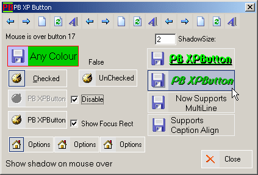

<div align="center">

## PB XP Button Update Build 6 \(10/1/2001\)


</div>

### Description

A smart looking Office XP Button - You can change the border & background colors, add shadows, disable it, mouse over & mouse out support, set the icon size....

Upadated: build 2 -

Added MultiLine Caption Support,,

Added Caption Alignment,,

Plus some little bugs fixed,,

** Update: Build 3 Added focus rect show or hide,

Added Keydown, KeyUp & KeyPress support,

Added Set Font Color on MouseOver,

Added Set Font Color on MouseDown,

** Update: Build 4 - Added Checkbox type button

** Update: Build 5

Fixed Problem with double click

Improverd the looks on the checkbutton,

Option button support,

Improved the shadow on the icon.......

Build 6 - Memory leak fixed....

If you find any bugs or have any suggestions please let know..
 
### More Info
 


<span>             |<span>
---                |---
**Submitted On**   |2001-09-30 08:51:12
**By**             |[Paul B1](https://github.com/Planet-Source-Code/PSCIndex/blob/master/ByAuthor/paul-b1.md)
**Level**          |Intermediate
**User Rating**    |4.8 (58 globes from 12 users)
**Compatibility**  |VB 6\.0
**Category**       |[Custom Controls/ Forms/  Menus](https://github.com/Planet-Source-Code/PSCIndex/blob/master/ByCategory/custom-controls-forms-menus__1-4.md)
**World**          |[Visual Basic](https://github.com/Planet-Source-Code/PSCIndex/blob/master/ByWorld/visual-basic.md)
**Archive File**   |[PB XP Butt272831012001\.zip](https://github.com/Planet-Source-Code/paul-b1-pb-xp-button-update-build-6-10-1-2001__1-27437/archive/master.zip)

### API Declarations

```
Private Declare Function ReleaseCapture Lib "user32" () As Long
Private Declare Function SetCapture Lib "user32" (ByVal hWnd As Long) As Long
Private Declare Function DrawText Lib "user32" Alias "DrawTextA" (ByVal hDC As Long, ByVal lpStr As String, ByVal nCount As Long, lpRect As RECT, ByVal wFormat As Long) As Long
Private Declare Function DrawIcon Lib "user32" (ByVal hDC As Long, ByVal X As Long, ByVal Y As Long, ByVal hIcon As Long) As Long
Private Declare Function DrawIconEx Lib "user32" (ByVal hDC As Long, ByVal xLeft As Long, ByVal yTop As Long, ByVal hIcon As Long, ByVal cxWidth As Long, ByVal cyWidth As Long, ByVal istepIfAniCur As Long, ByVal hbrFlickerFreeDraw As Long, ByVal diFlags As Long) As Long
Private Declare Function DrawFocusRect Lib "user32" (ByVal hDC As Long, lpRect As RECT) As Long
Private Declare Function SetRect Lib "user32" (lpRect As RECT, ByVal X1 As Long, ByVal Y1 As Long, ByVal X2 As Long, ByVal Y2 As Long) As Long
Private Declare Function SetRectEmpty Lib "user32" (lpRect As RECT) As Long
Private Declare Function CreateSolidBrush Lib "gdi32" (ByVal crColor As Long) As Long
Private Declare Function FillRect Lib "user32" (ByVal hDC As Long, lpRect As RECT, ByVal hBrush As Long) As Long
Private Declare Function FrameRect Lib "user32" (ByVal hDC As Long, lpRect As RECT, ByVal hBrush As Long) As Long
Private Declare Sub OleTranslateColor Lib "oleaut32.dll" (ByVal Clr As Long, ByVal hPal As Long, ByRef lpcolorref As Long)
Private Declare Function DeleteObject Lib "gdi32" (ByVal hObject As Long) As Long
```


